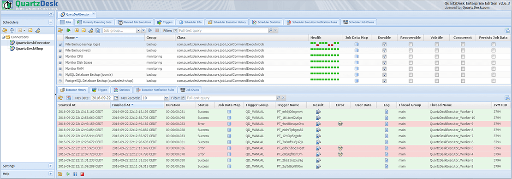

QuartzDesk Executor (QE) is a simple, yet powerful Quartz scheduler based web application that allows you to replace legacy scheduling systems, such as Unix/Linux cron, with a robust, scalable and optionally distributed scheduling system that offers many advantages such as:

* User-friendly and web-based GUI.
* Viewing the list of all currently executing jobs.
* Persistent execution history of individual jobs and triggers.
* Job execution notifications (email, IM, SNMP Trap, external web-service, ...).
* Job chaining capabilities allowing you to create complex workflows.
* Visual execution statistics.
* Interception of messages produced by executed jobs in the QE log and/or on stdout/sterr.
* JAX-WS SOAP endpoints exposing most of the functionality accessible in the GUI.
* Etc. 

**In order to make use of all these features, it is required that you also install [QuartzDesk](https://www.quartzdesk.com).** QuartzDesk is an enterprise-class management and monitoring platform for Java Quartz schedulers embedded in all types of Java applications. 

# 

# Available Quartz Job Implementation Classes

##  com.quartzdesk.executor.core.job.LocalCommandExecutorJob
A Quartz job implementation class that can be used to execute local commands (e.g. shell commands) and scripts located on the local host (i.e. the host QE has been deployed on).

This job supports the following job data map parameters:

`command`: a shell command or script to execute on the local host.

`commandWorkDir`: an optional work directory to pass to the executed command / script as the "current working directory".

`commandArgs`: an optional, space-separated list of arguments to pass to the command / script. If you need to pass an argument containing spaces, enclose the argument value in double or single quotes.

##  com.quartzdesk.executor.core.job.SshRemoteCommandExecutorJob
A Quartz job implementation class that can be used to execute commands (e.g. shell commands) and scripts located on a remote host over SSH. This job requires the remote host to run the SSHD service through which commands and scripts are executed.

This job supports the following job data map parameters:

`sshHost`: a host name or IP of the remote host where the command or script should be executed.

`sshPort`: an SSH port number of the SSHD service running on the remote host.

`sshUser`: an SSH username to authenticate the user with.

`sshPassword`: an SSH password to authenticate the user with if the password-based authentication should be used.

`sshPrivKeyFile`: filepath of the SSH private key file to authenticate the user with if the key-based authentication should be used.

`command`: a shell command or script to execute on the remote host.

`commandArgs`: an optional, space-separated list of arguments to pass to the command / script. If you need to pass an argument containing spaces, enclose the argument value in double or single quotes.

If both `sshPassword` and `sshPrivKeyFile` are specified, then the key-based authentication takes precedence.

##  com.quartzdesk.executor.core.job.UrlInvokerJob
A Quartz job implementation class that can be used to execute HTTP POST requests to the configured URL.

This job supports the following job data map parameters:

`url`: the URL to send the HTTP POST requests to.

`username`: an optional HTTP Basic authentication username.

`password`: an optional HTTP Basic authentication password.

##  com.quartzdesk.executor.core.job.SqlQueryExecutorJob
A Quartz job implementation class that can be used to execute arbitrary SQL queries on a local or remote DB server through JDBC. If the executed query returns a result set, the data is exported into the CSV format and saved as the job's execution result that can be viewed in the QuartzDesk GUI, passed to chained jobs, or used in execution notification rules to fire notification messages.

This job supports the following job data map parameters:

`jdbcDriver`: the fully-qualified class name of the JDBC driver to use. The driver must be on the QE application's classpath.

`jdbcUsername`: a JDBC username.

`jdbcPassword`: a JDBC password.

`jdbcUrl`: a JDBC URL pointing to the target database.

`sqlQuery`: the SQL query to execute.

##  com.quartzdesk.executor.core.job.ExternalQuartzJobExecutorJob
A Quartz job implementation class that allows you to schedule externalized Quartz job implementation classes that reside outside of QE. Therefore you can easily update these externalized Quartz jobs without restarting and redeploying QE and you can even schedule execution of multiple versions of the same Quartz job implementation class.

This job supports the following job data map parameters:

`jobClassName`: the fully qualified Quartz job implementation class name. The job class must extend the Quartz org.quartz.Job interface.

`jobHomeDir`: the Quartz job home directory that contains all classes and libraries required by the job. This directory must have the following structure:

&nbsp;&nbsp;&nbsp;&nbsp;`classes`: a directory containing classes and resources required by the Quartz job.
  
&nbsp;&nbsp;&nbsp;&nbsp;`lib`: a directory containing libraries (JAR files) required by the Quartz job. Do not add the Quartz library into this directory because this library is already provided by QE!

# Forking

We encourage you to fork, extend, repackage and distribute QE and all derivative work as you want. We only kindly ask you to follow these guidelines:

* Please change the root package name of your forked version from *com.quartzdesk* to a different package name so that it is clear your forked version is not the original QE version that we maintain. 
* Please do not refer to your forked version as QuartzDesk Executor, nor as QE. 
* Please consider including a link to our QuartzDesk Executor GitHub repository in your documentation. 

Thank you.

# Contributing

If you want to contribute your changes and improvements, please contact us so that we can send you our contributing guidelines. Included are coding standards, and notes on development.

# Copyright and license

Code and documentation copyright 2015-2016 the QuartzDesk Executor authors and QuartzDesk.com. Code and docs released under the MIT license.